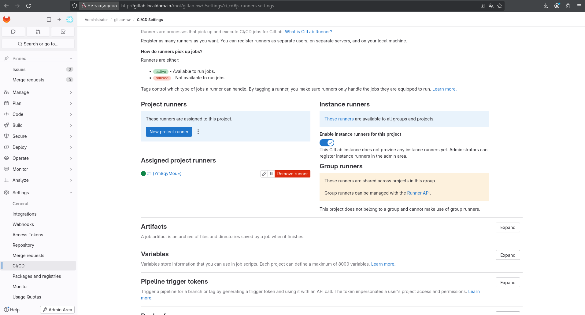
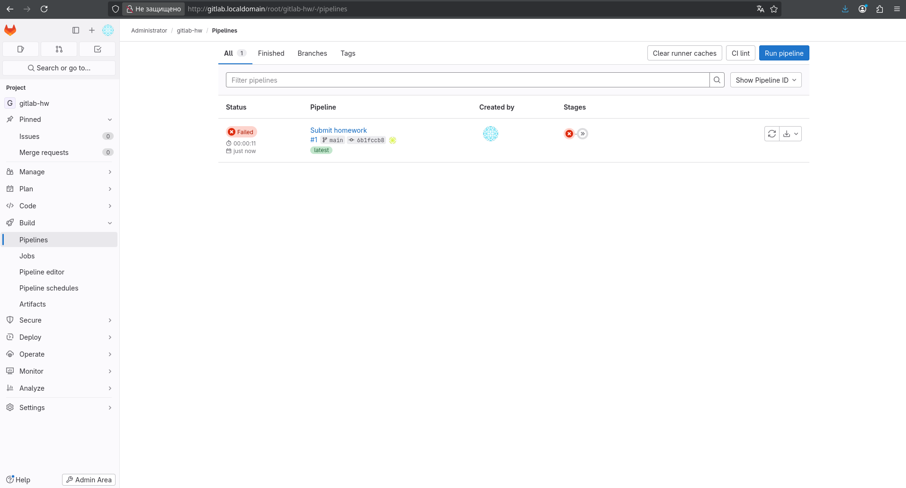

# Домашнее задание к занятию "`GitLab`" - `Сидоренко Алексей`

### Задание 1

Что нужно сделать:

    Разверните GitLab локально, используя Vagrantfile и инструкцию, описанные в этом репозитории.
    Создайте новый проект и пустой репозиторий в нём.
    Зарегистрируйте gitlab-runner для этого проекта и запустите его в режиме Docker. Раннер можно регистрировать и запускать на той же виртуальной машине, на которой запущен GitLab.

В качестве ответа в репозиторий шаблона с решением добавьте скриншоты с настройками раннера в проекте.

---

### Задание 2
Настроен CI/CD пайплайн для сборки Go-приложения. Файл `.gitlab-ci.yml` добавлен в репозиторий. Пайплайн успешно проходит стадии сборки и тестирования.

